  

---

### 🚀 Projects

*   **ATLAS — Sovereign Wealth Management**: Intelligent wealth management platform powered by Claude AI. [Launch Node](https://atlas-personal-finance.vercel.app/)
*   **Shingan — Clear-Eyed Hybrid ORB**: Zarattini 5m × Valkyrie φ, 44 tickers Top5, 1.21 Sharpe 2021-2025. Ponytail ultra 150L. [Launch Lab](https://github.com/LNSTT369/shingan)
*   **Transformation Architect**: Scalable architectural framework and transformation logic. [View Archive](https://github.com/LNSTT369/the-transformation-architect)
*   **Algorithmic Trading**: Market analysis framework and automated execution systems. [Access Repo](https://github.com/LNSTT369/NightWatcher.git)

### 🛠️ Expertise

*   **Languages**: Python, TypeScript, Solidity
*   **Frameworks**: React, Next.js, Node.js
*   **Domains**: AI/LLM Ops, Trading Algos, System Design
*   **Infrastructure**: Docker, AWS, PostgreSQL

### 🌐 Connect

[Portfolio](https://chiranjeevportfolio.vercel.app/) • [LinkedIn](https://linkedin.com/in/chiranjeevshah) • [Twitter](https://x.com/showtimeshah) • [Topmate](https://www.topmate.io/showtime/) • [SoundCloud](https://soundcloud.com/latenightwithshowtime)
